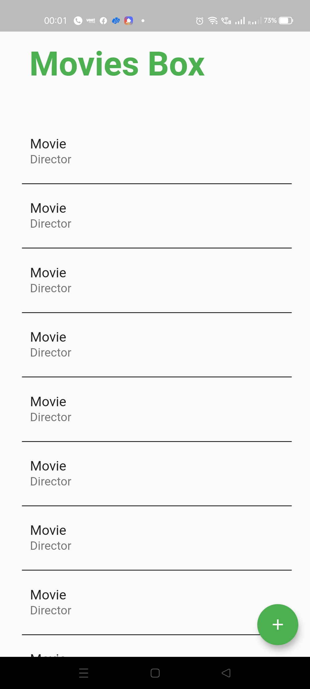
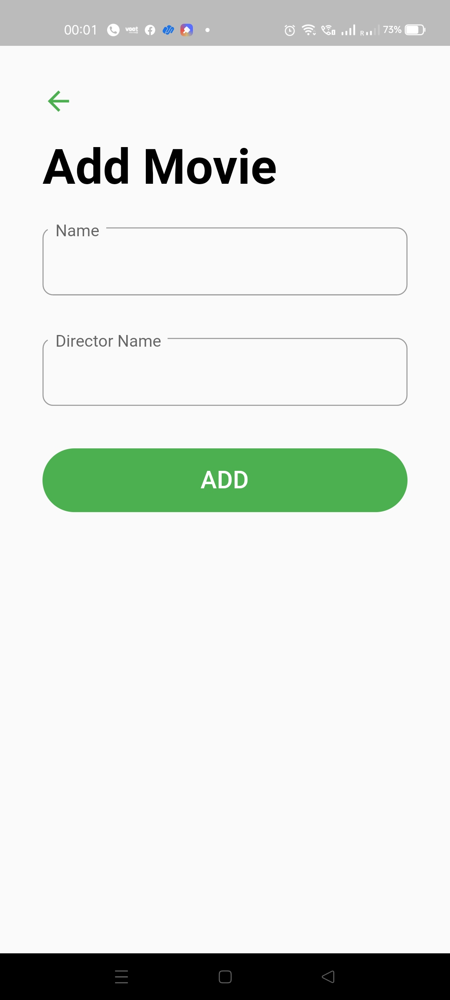
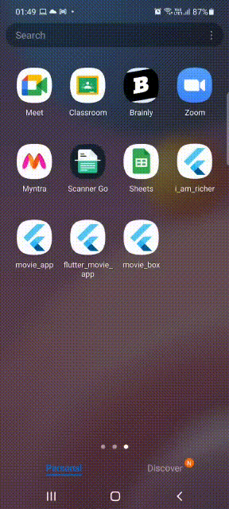

<div align="center"><h2 align="center">
   MovieBox :Collection of Watched Movies
</h2>
<p align="center">
  
  `Dart` `Flutter` `Sqflite`
  
</p>
  </div>

## :eyes:Overview
Watched movies                 | Add movie               |
:-------------------------:|:-------------------------:|
 |  
    
## :clapper:Preview

    

## :scroll:Database connection
```dart
class DBProvider {
  DBProvider._();
  static final DBProvider dataBase = DBProvider._();
  static Database? _database;

  Future<Database?> get database async {
    if (_database != null) return _database;

    // if _database is null we instantiate it
    _database = await initDataBase();
    return _database;
  }

  Future<Database> initDataBase() async {
    Directory dir = await getApplicationDocumentsDirectory();
    String path = dir.path + 'movie.db';
    final movieDb = await openDatabase(path, version: 1, onCreate: _createDb);
    return movieDb;
  }

  void _createDb(Database db, int version) async {
    await db.execute(
        'CREATE TABLE tasks (id INTEGER PRIMARY KEY AUTOINCREMENT,name TEXT,dname TEXT)');
  }

  addNewTask(Task newTask) async {
    final db = await database;
    db!.insert("tasks", newTask.toMap(),
        conflictAlgorithm: ConflictAlgorithm.replace);
  }

  Future<dynamic> getTask() async {
    final db = await database;
    var res = await db!.query("tasks");
    if (res.length == 0) {
      return null;
    } else {
      var resultMap = res.toList();
      return resultMap.isNotEmpty ? resultMap : Null;
    }
  }
}
```

## How to run
    
    - flutter packages get (Build the app)
    - flutter run->
    - Run the app (Simulator/ Real Device )
